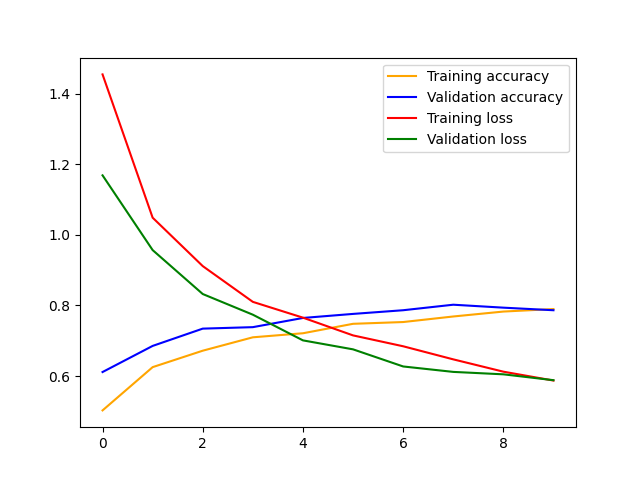
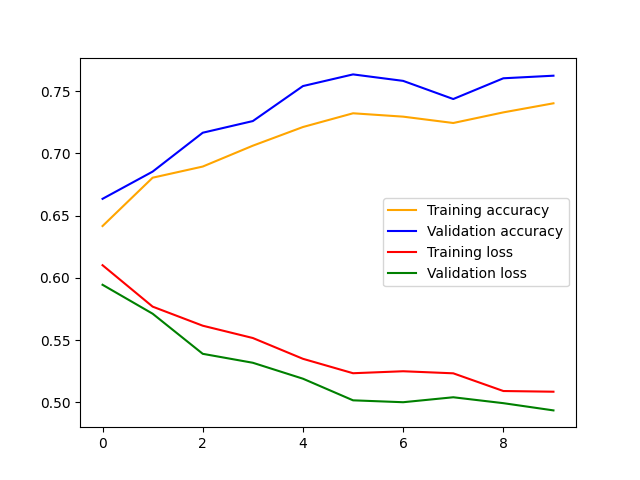

# Research Project by Sara Bouazizi
# Classification of medical images into organ and detection of cancer

## Introduction

Deep learning has revolutionized the field of medical imaging, with applications in a wide range of tasks, including cancer detection. Deep learning algorithms are able to learn complex patterns in medical images that are often invisible to the human eye. This allows them to identify cancer cells with much greater accuracy than traditional methods.

For example, deep learning algorithms have been shown to be very effective at detecting breast cancer in mammograms. In one study, a deep learning algorithm was able to achieve an accuracy of 99% in detecting breast cancer, compared to 85% for human radiologists. This means that deep learning algorithms have the potential to save lives by detecting cancer earlier and more accurately.

In addition to cancer detection, deep learning is also being used for a variety of other tasks in medical imaging, such as:

1. Segmentation of organs and tissues
2. Classification of diseases
3. Tracking tumor growth
4. Planning and guiding surgery

As deep learning algorithms continue to improve, they are likely to play an increasingly important role in the diagnosis and treatment of cancer.

In this project, we train models to detect cancer and identify the organ in the image.

## Experiment

In this project, I use the Multi Cancer image database from [Kaggle](https://www.kaggle.com/datasets/obulisainaren/multi-cancer).
There are two tasks that are trained. The first one classifies the image into the organ that is in the image. There are 9 classes: 
```python
organ_labels = ["Blood", "Brain", "Breast", "Cervix", "Colon", "Kidney", "Lung", "Lymph", "Mouth"]
```

The second task is trained to detect cancer in the image. There are 2 classes:
```python
cancer_labels = ["Benign", "Malignant"]
```

A test script is provided to pick a random batch of images and then run both tasks and output the results.

Both models use the pre-trained InceptionV3 model from *tensorflow.keras.applications*.
The model top is replaced to do the required classification task. The model top code is:
```python
model_top = Sequential()
model_top.add(GlobalAveragePooling2D(input_shape=base_model.output_shape[1:], data_format=None)),
model_top.add(Dense(256, activation='relu'))
model_top.add(Dropout(0.2))
model_top.add(Dense(num_classes))
```

The model summary for the organ classiciation is shown below:
```
_________________________________________________________________
 Layer (type)                Output Shape              Param #
=================================================================
 input_2 (InputLayer)        [(None, 256, 256, 3)]     0

 rescaling (Rescaling)       (None, 256, 256, 3)       0

 tf.math.truediv (TFOpLambda  (None, 256, 256, 3)      0
 )

 tf.math.subtract (TFOpLambd  (None, 256, 256, 3)      0
 a)

 inception_v3 (Functional)   (None, 6, 6, 2048)        21802784

 sequential (Sequential)     (None, 9)                 526857

=================================================================
Total params: 22,329,641
Trainable params: 526,857
Non-trainable params: 21,802,784
_________________________________________________________________
```

The model summary for the cancer detection is shown below:
```
_________________________________________________________________
 Layer (type)                Output Shape              Param #
=================================================================
 input_2 (InputLayer)        [(None, 256, 256, 3)]     0

 rescaling (Rescaling)       (None, 256, 256, 3)       0

 tf.math.truediv (TFOpLambda  (None, 256, 256, 3)      0
 )

 tf.math.subtract (TFOpLambd  (None, 256, 256, 3)      0
 a)

 inception_v3 (Functional)   (None, 6, 6, 2048)        21802784

 sequential (Sequential)     (None, 2)                 525058

=================================================================
Total params: 22,327,842
Trainable params: 525,058
Non-trainable params: 21,802,784
_________________________________________________________________
```

## Results

### Organ Classification Task

The model for detecting the organ in the image has the following training results:
>> loss: 0.6038 - accuracy: 0.7864 - val_loss: 0.6070 - val_accuracy: 0.7781
When testing on random images, the following results are shown:
```
1/1 [==============================] - 3s 3s/step
Predicted: Colon  and correct label is:  Colon
Predicting for image 2
1/1 [==============================] - 0s 16ms/step
Predicted: Blood  and correct label is:  Blood
Predicting for image 3
1/1 [==============================] - 0s 16ms/step
Predicted: Mouth  and correct label is:  Mouth
Predicting for image 4
1/1 [==============================] - 0s 16ms/step
Predicted: Cervix  and correct label is:  Cervix
Predicting for image 5
1/1 [==============================] - 0s 31ms/step
Predicted: Blood  and correct label is:  Cervix
Predicting for image 6
1/1 [==============================] - 0s 16ms/step
Predicted: Cervix  and correct label is:  Cervix
Predicting for image 7
1/1 [==============================] - 0s 16ms/step
Predicted: Cervix  and correct label is:  Lung
Predicting for image 8
1/1 [==============================] - 0s 16ms/step
Predicted: Kidney  and correct label is:  Kidney
Predicting for image 9
1/1 [==============================] - 0s 31ms/step
Predicted: Brain  and correct label is:  Brain
Predicting for image 10
1/1 [==============================] - 0s 16ms/step
Predicted: Brain  and correct label is:  Brain
Predicting for image 11
1/1 [==============================] - 0s 16ms/step
Predicted: Breast  and correct label is:  Breast
Predicting for image 12
1/1 [==============================] - 0s 6ms/step
Predicted: Blood  and correct label is:  Blood
Predicting for image 13
1/1 [==============================] - 0s 31ms/step
Predicted: Brain  and correct label is:  Brain
Predicting for image 14
1/1 [==============================] - 0s 16ms/step
Predicted: Blood  and correct label is:  Lung
Predicting for image 15
1/1 [==============================] - 0s 31ms/step
Predicted: Mouth  and correct label is:  Colon
Predicting for image 16
1/1 [==============================] - 0s 31ms/step
Predicted: Cervix  and correct label is:  Cervix
```
The training history is shown in the 


### Cancer Detection Task
The model for predicting if the image shows cancer or not has the following training results:
>> loss: 0.5093 - accuracy: 0.7377 - val_loss: 0.4893 - val_accuracy: 0.7719
When testing on random images, the following results are shown:
```
Predicting for image 1
1/1 [==============================] - 1s 656ms/step
Predicted: Malignant  and correct label is:  Malignant
Predicting for image 2
1/1 [==============================] - 0s 16ms/step
Predicted: Benign  and correct label is:  Benign
Predicting for image 3
1/1 [==============================] - 0s 16ms/step
Predicted: Benign  and correct label is:  Benign
Predicting for image 4
1/1 [==============================] - 0s 16ms/step
Predicted: Malignant  and correct label is:  Malignant
Predicting for image 5
1/1 [==============================] - 0s 16ms/step
Predicted: Malignant  and correct label is:  Malignant
Predicting for image 6
1/1 [==============================] - 0s 16ms/step
Predicted: Malignant  and correct label is:  Malignant
Predicting for image 7
1/1 [==============================] - 0s 31ms/step
Predicted: Malignant  and correct label is:  Malignant
Predicting for image 8
1/1 [==============================] - 0s 31ms/step
Predicted: Malignant  and correct label is:  Malignant
Predicting for image 9
1/1 [==============================] - 0s 31ms/step
Predicted: Benign  and correct label is:  Malignant
Predicting for image 10
1/1 [==============================] - 0s 31ms/step
Predicted: Malignant  and correct label is:  Malignant
Predicting for image 11
1/1 [==============================] - 0s 31ms/step
Predicted: Malignant  and correct label is:  Malignant
Predicting for image 12
1/1 [==============================] - 0s 31ms/step
Predicted: Benign  and correct label is:  Benign
Predicting for image 13
1/1 [==============================] - 0s 16ms/step
Predicted: Malignant  and correct label is:  Malignant
Predicting for image 14
1/1 [==============================] - 0s 16ms/step
Predicted: Malignant  and correct label is:  Malignant
Predicting for image 15
1/1 [==============================] - 0s 31ms/step
Predicted: Malignant  and correct label is:  Benign
Predicting for image 16
1/1 [==============================] - 0s 16ms/step
Predicted: Malignant  and correct label is:  Malignant
``` 

The training history is shown in the 

## Conclusion

In this project, I trained 2 similar models to do 2 different tasks. The first task was to identify the organ that is in the medical image. The second task was to detect if there is cancer or not. The accuracy of the model is about 80%. This means that it can improved to detect things better and to be more reliable. In the future, this work can continue to improve by experimenting with other pre-trained models and with better model tops. 
